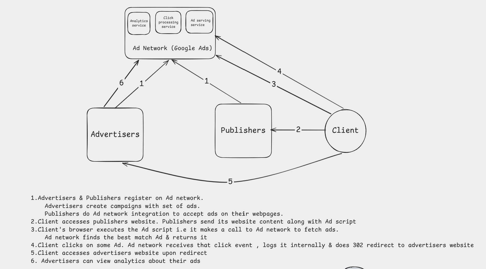

## Overview
Serve ads, track impressions/clicks/conversions, and provide campaign analytics to advertisers.

## Functional Requirements
1. Advertisers should be able to create campaigns with a set of ads, daily budget, bid strategy, start time, end time.
2. User should be able to request ads when publisher page loads.
3. User should be redirected to advertiser's page upon clicking on the ad. System should record click events when user clicks an ad.
4. Advertiser should be able to view analytics for their ads.
			i. User should be able to query clicks grouped by date, campaign, ad , country, device
NOTE: refer query patterns
## Out of Scope
1. User auth & authz
2. Fraud detection
3. Advanced ML-based ad ranking

## Non-Functional Requirements

1. Fault Tolerance
2. CAP Theorem:
   FR-1: & FR-2
       1) availability > consistency
           a) staleness allowed = 10s
           b) If an advertiser creates a campaign, it is acceptable if the campaign does not immediately start serving ads for the next 10s
   FR-3 & FR-4
       1) availability > consistency
           a) staleness allowed = 1min
           b) A click happens at 10:00:00. Advertiser opens analytics at 10:00:10. If the click is not visible yet, it is acceptable.But it should usually appear within 1 minute.
3. System Scale:
               i. new system , 10 years
               ii. market size: 100,000 advertisers, 1M active campaigns, ~10M ads.
4. Throughput & Latencies:
               i. FR-1:
                   1) write tps = 100k/day = 1/s , peak = 5/s
                   2) write latency = p99 < 500ms
               ii. FR-2:
                   1) Read QPS = 1B/day = 10k/s , peak = 50k/s
                   2) Read latency = p99 < 100ms
               iii. FR-3:
                   1) Read QPS = 10M/day ( assuming 1 in 100 ads gets a click) = 100/s , peak = 1k/s
                   2) Read Latency = p99 < 100ms
               iv. FR-4:
                   1) Read QPS = 100k/day = 1/s, peak 5/s
                   2) Read Latency = p99 < 1-2s
5. Problem specific:
               • Click fraud / bot detection: dedupe rapid repeat clicks from same IP/user/ad within a short window; flag is_valid=false clicks so they don't count toward spend or analytics.
               • Idempotency on clicks: each ad impression carries a signed click-token; redirect endpoint rejects/dedupes replayed tokens so refreshing or double-clicking doesn't double-charge.
               • Budget pacing & hot campaigns: a viral/high-budget campaign can get a disproportionate share of ad requests — use sharded, approximate counters (e.g. Redis INCR per campaign per minute bucket) instead of a single row lock, to avoid write contention as a hot key.
               • Hot ad creatives: cache ad creative assets on a CDN, not served from the app tier.
               • Traffic spike handling (cost-effective): Ad Serving autoscaling on QPS with pre-warmed cache; avoid provisioning peak capacity 24/7 — use burst-capable stateless compute (e.g. autoscaling groups/serverless) since ad request traffic is highly diurnal.
               • PII/targeting data: country/device stored, but no raw IP or precise geo retained longer than needed for fraud checks; aggregate before long-term retention.
   Data retention: raw click events retained ~90 days hot (OLAP), older data rolled up into daily aggregates in cold storage for the 10-year analytics history.

## API Design


### FR-1: Create Campaign
Protocol: REST 
```http
POST /api/v1/campaigns

REQUEST BODY:
{
  "advertiserId": "adv_9821",
  "name": "Summer Sale 2026",
  "dailyBudget": 500.00,
  "bidStrategy": "CPC",
  "bidAmount": 0.75,
  "startTime": "2026-07-15T00:00:00Z",
  "endTime": "2026-08-15T00:00:00Z",
  "ads": [
    {
      "title": "50% off summer collection",
      "creativeUrl": "https://cdn.example.com/creatives/summer1.png",
      "landingPageUrl": "https://advertiser.com/summer-sale"
    }
  ]
}

STATUS : 201 CREATED
RESPONSE BODY:
{
  "campaignId": "camp_10293",
  "status": "ACTIVE",
  "adIds": ["ad_55011"]
}
```


### FR-2: Request Ad
Protocol: REST
```http
GET /api/v1/ads?publisherId=pub_442&placementId=banner_top&country=IN&device=mobile

STATUS : 200 OK
RESPONSE BODY:
{
  "adId": "ad_55011",
  "campaignId": "camp_10293",
  "creativeUrl": "https://cdn.example.com/creatives/summer1.png",
  "clickUrl": "https://ads.example.com/r/click_tok_a1b2c3"
}
```

### FR-3: Click Redirect
Protocol: REST
```http
GET /api/v1/ads/{adId}

STATUS : 302 FOUND
RESPONSE HEADER:
Location: https://advertiser.com/shoes
```

### FR-4: Query Analytics
Protocol: REST
```http
GET /api/v1/campaigns/camp_10293/analytics?startDate=2026-07-01&endDate=2026-07-09&groupBy=date,ad,country,device

STATUS : 200 OK
RESPONSE BODY:
{
  "campaignId": "camp_10293",
  "results": [
    {
      "date": "2026-07-08",
      "adId": "ad_55011",
      "country": "IN",
      "device": "mobile",
      "clicks": 4210
    },
    {
      "date": "2026-07-08",
      "adId": "ad_55011",
      "country": "US",
      "device": "desktop",
      "clicks": 1875
    }
  ]
}
```


## High-Level Design

FR-1:
Table:
- campaigns
  - id
  - advertiserId
  - name
  - dailyBudget
  - bidAmount
  - status
  - startTime
  - endTime
  - createdAt

- campaignTargeting
  - id
  - campaignId
  - targetCountry
  - targetKeyword
  - device

- ads
  - id
  - campaignId
  - title
  - description
  - landingUrl
  - imageUrl
  - status
  - createdAt

```sql
INSERT INTO campaigns (
    advertiser_id,
    name,
    daily_budget,
    bid_amount,
    status,
    start_time,
    end_time,
    created_at
)
VALUES (
    'adv-123',
    'Summer Sale Campaign',
    10000,
    5,
    'ACTIVE',
    '2026-12-01T00:00:00Z',
    '2026-12-31T23:59:59Z',
    NOW()
);
```

EXPLANATION:
Campaign Service allows advertisers to create campaigns.

Each campaign has budget, bid, targeting rules and active time range.

Targeting rules are stored in `campaignTargeting`.

Ad creatives are stored in `ads`.

One campaign can have multiple ads.

FR-2:
Table:
- campaigns
  - id
  - advertiserId
  - dailyBudget
  - bidAmount
  - status
  - startTime
  - endTime

- campaignTargeting
  - id
  - campaignId
  - targetCountry
  - targetKeyword
  - device

- ads
  - id
  - campaignId
  - title
  - description
  - landingUrl
  - imageUrl
  - status

```sql
SELECT a.id, a.campaign_id, a.title, a.description, a.landing_url, a.image_url
FROM ads a
JOIN campaigns c ON a.campaign_id = c.id
JOIN campaign_targeting ct ON c.id = ct.campaign_id
WHERE c.status = 'ACTIVE'
  AND a.status = 'ACTIVE'
  AND c.start_time <= NOW()
  AND c.end_time >= NOW()
  AND ct.target_country = 'IN'
  AND ct.target_keyword = 'running shoes'
ORDER BY c.bid_amount DESC
LIMIT 1;
```

EXPLANATION:
Ad Serving Service receives the user/page/search context.

The context can contain country, device, placement and keywords.

The service finds active campaigns matching the targeting rules.

For simple HLD interview design, ads can be ranked by bid amount.

The selected ad is returned to the client.

When the ad is returned, the system also creates an impression event.

This impression event should be pushed asynchronously to an event queue.

Redis can cache active campaign and targeting data so that every ad request does not hit Postgres.

FR-3:
Table:
- adEvents
  - id
  - eventType
  - adId
  - campaignId
  - advertiserId
  - userId
  - impressionTrackingId
  - eventTime
  - country
  - device
  - placement
  - bidAmount

```sql
INSERT INTO ad_events (
    event_type,
    ad_id,
    campaign_id,
    advertiser_id,
    user_id,
    impression_tracking_id,
    event_time,
    country,
    device,
    placement,
    bid_amount
)
VALUES (
    'CLICK',
    'ad-123',
    'camp-123',
    'adv-123',
    'user-123',
    'imp-123',
    NOW(),
    'IN',
    'MOBILE',
    'SEARCH_TOP',
    5
);
```

EXPLANATION:
Ad events are the most important part of the analytics system.

The system records different event types:

```text
IMPRESSION
CLICK
CONVERSION
```

An `IMPRESSION` event is recorded when an ad is shown.

A `CLICK` event is recorded when the user clicks the ad.

A `CONVERSION` event is recorded when the user performs the desired action like purchase, signup or app install.

Ad Serving Service should not synchronously write events to Postgres.

Instead, it pushes ad events to Kafka or a queue.

Analytics Worker consumes these events and stores them in `adEvents`.

This keeps ad serving fast and allows analytics to be updated with a small delay.

FR-4:
Table:
- adEvents
  - id
  - eventType
  - adId
  - campaignId
  - advertiserId
  - userId
  - eventTime
  - country
  - device
  - placement
  - bidAmount

- campaignAnalyticsHourly
  - campaignId
  - adId
  - bucketStart
  - country
  - device
  - placement
  - impressions
  - clicks
  - conversions
  - spend

```sql
SELECT
    SUM(impressions) AS impressions,
    SUM(clicks) AS clicks,
    SUM(conversions) AS conversions,
    SUM(spend) AS spend
FROM campaign_analytics_hourly
WHERE campaign_id = 'camp-123'
  AND bucket_start >= '2026-12-10T00:00:00Z'
  AND bucket_start < '2026-12-11T00:00:00Z';

SELECT
    bucket_start,
    SUM(impressions) AS impressions,
    SUM(clicks) AS clicks,
    SUM(conversions) AS conversions,
    SUM(spend) AS spend
FROM campaign_analytics_hourly
WHERE campaign_id = 'camp-123'
GROUP BY bucket_start
ORDER BY bucket_start;
```

EXPLANATION:
Advertisers need campaign analytics like impressions, clicks, CTR, CPC, spend and conversions.

Basic formulas:

```text
CTR = clicks / impressions * 100
CPC = spend / clicks
Conversion Rate = conversions / clicks * 100
```

Raw `adEvents` table stores all events.

But analytics dashboards should not scan raw events every time.

So Analytics Worker can also update `campaignAnalyticsHourly`.

This table stores hourly aggregated metrics for each campaign, ad, country, device and placement.

Analytics Service reads from `campaignAnalyticsHourly` and returns:

```text
1. Total impressions
2. Total clicks
3. Total conversions
4. CTR
5. CPC
6. Spend
7. Time-based trends
8. Breakdown by country, device and placement
```

This keeps advertiser dashboards fast while still keeping raw events for detailed debugging.