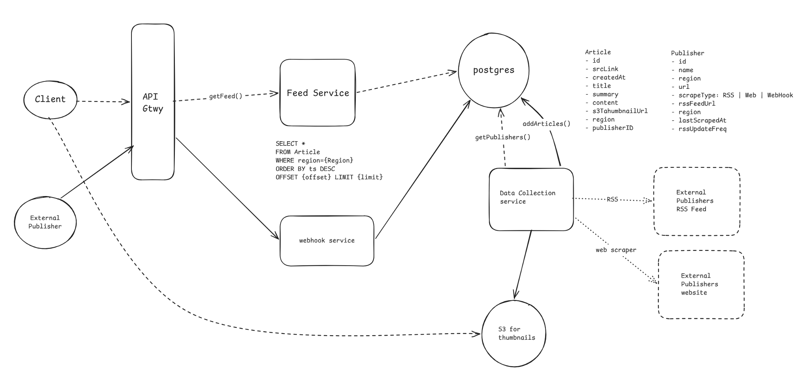
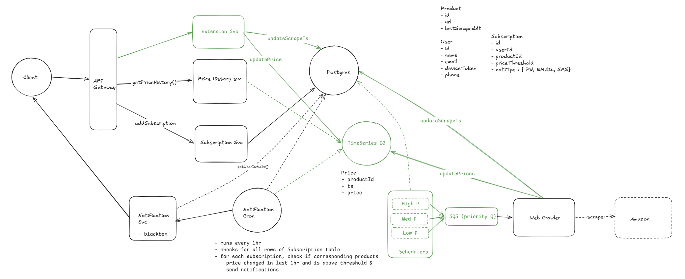
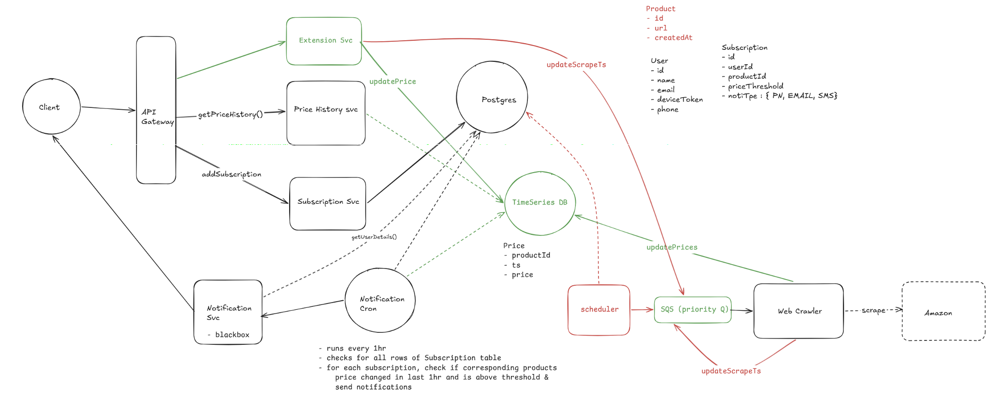
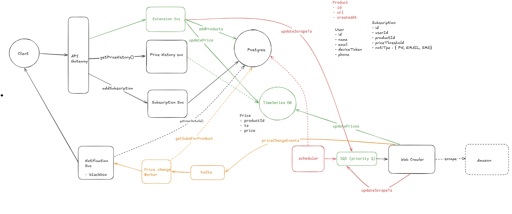

## Functional Requirements

1. Users should be able to view price history for Amazon products through the website or browser extension.
2. Users should be able to view price history over a sliding time window.
3. Users should be able to subscribe to price-drop notifications with a configured threshold.
4. Notifications can be delivered through the website or browser extension.

## Out of Scope

1. Product search and discovery inside the platform.
2. Price comparison across multiple retailers.

## Non-Functional Requirements

No single point of failure (fault tolerance).
CAP Theorem:
   Url conversion & access (FR-1 & FR-2):
      availability > consistency
      1-5 sec inconsistency allowed
   Analytics record & view (FR-3 & FR-4):
      availability > consistency :
      Minor delay (1–5 sec) in analytics updates is acceptable.
Throughput & Latencies:
   Url creation (FR-1):
      Write TPS = 1M/day = 10/s
      Write Latency = never mind
   Url access (FR-2):
      Read QPS = 100M/day = 1k/s
      Read Latency = 100ms
Handle Celebrity/Hot keys
Handle traffic spikes in cost effective way (optional, only if time at end)

## Core Entities

- User
- Product
- Price
- Subscription

## API Design

```http
GET /products/{product_id}/price?period=30d&granularity=daily
```

Returns daily average price history for the last 30 days. The query shape is fixed, so the API does not need to expose an arbitrary query object like a metrics monitoring system.

```http
POST /subscriptions
```

```json
{
  "product_id": "B001",
  "price_threshold": 1200,
  "notification_type": "browser_extension"
}
```

Response:

```http
200 OK
```

## High-Level Design



The system has four major flows:

1. Product tracking and scheduling.
2. Price collection through crawlers and browser extension signals.
3. Price-history storage and read aggregation.
4. Subscription evaluation and notification delivery.

The crawler workers consume product IDs from priority queues. Products with more subscribers or more recent user interaction are crawled more frequently. The browser extension can also submit observed prices while users browse Amazon, which reduces crawler load and helps discover new products.

## Deep Dives

### Read Latency

Price table scale:

- Rows: `500M products * 24 samples/day * 400 days/year * 10 years = 5 * 10^13`.
- Approximate row size: 100 bytes.
- Approximate table size: 5PB.

Subscription table scale:

- Rows: `1M users * 1 subscription/week * 4 weeks/month * 12 months/year * 10 years = 500M`.
- Approximate table size: 50GB.

For a 10-year price history with daily granularity, a naive query over raw price samples is too expensive.

Options:

1. No index: bad. Large scans cannot reliably stay under 500ms.
2. Indexing: good. With an index on product and timestamp, the query touches only the relevant product range.
3. Scheduled pre-aggregation: good. A daily cron can write daily, weekly, and monthly summaries into separate tables. This is faster at read time but adds storage and can introduce up to one day of staleness.
4. Time-series database: great. A TSDB is optimized for timestamp range scans and aggregations, usually giving faster reads and better compression.

### Notification Latency

The hard requirement is detecting useful price drops within 1 hour. Crawling all products every hour is not feasible.

With a 1 request per second crawler rate limit:

- Crawling 500M products takes about 500M seconds on one VM.
- Even with 1000 VMs, crawling everything takes multiple days.
- We need priority-based crawling.

Product popularity follows a long-tail distribution. We should crawl products based on user interest:

| Product tier | User interest | Crawl target |
|---|---:|---|
| High priority | Most subscribed or recently viewed | Around 1 hour |
| Medium priority | Some user interest | Around 15 hours |
| Low priority | Rarely viewed | Best effort |

Signals for product priority:

1. Number of active subscriptions.
2. Recent user interaction.
3. Browser extension observations.
4. Product age and historical volatility.

### Scheduler Strategy

Approach 1:

- Run separate schedulers for high, medium, and low priority products.
- Each scheduler enqueues products into the relevant queue.
- Autoscale crawler workers based on queue depth.

Problem:

- If each priority tier needs its own large crawler pool, VM count can become too high.

Improvement:

- Let the browser extension submit observed price updates.
- Store `lastScrapedAt` or `lastObservedAt` on each product.
- Run schedulers frequently and enqueue only products whose freshness has expired.

Approach 2:

- Use a queue with visibility timeout to re-drive recurring crawls.
- Scheduler mainly discovers newly added products.
- Workers process products and reinsert or defer them based on next crawl time.
- Autoscale workers using visible message count.

This reduces database writes and gives better queue-driven backpressure.



### Handling Browser Extension Price Updates

Browser extension updates are useful but cannot be trusted blindly.

Mitigations:

1. Treat extension updates as signals, not authoritative writes.
2. Require multiple independent confirmations before triggering notifications for large changes.
3. Compare submitted prices against recent crawler observations.
4. Rate limit and reputation-score extension clients.
5. Send high-impact price changes to a crawler verification queue.

### Write TPS

Subscription writes are small:

- `addSubscription`: around 10 writes per second.

Crawler writes are larger:

- If 3K crawler workers each write one price update per second, the TSDB sees around 3K writes per second.
- This is within the typical range for a purpose-built time-series store, but the exact DB choice should be validated.

### Notification Evaluation

Naive polling:

- Scan 500M subscriptions and 500M latest price rows.
- Around 1B rows may be touched.
- This can still take minutes even with efficient batch reads.

Cursor-based polling:

- Use monotonic subscription IDs.
- Poll in small batches instead of scanning everything at once.
- If the poll interval is 1 second, the SQL limit can be approximately `1B / 3600`.
- This smooths peak QPS but can delay notifications and creates cron failure risk.

CDC or event-driven evaluation:

- Replace polling with price-change events.
- Evaluate subscriptions when price updates arrive.
- This gives more real-time notifications and avoids repeated full scans.

Dual write option:

- The crawler writes to the TSDB and also emits price-change events.
- This allows filtering tiny changes and batching rapid updates before publishing.
- It avoids DB trigger overhead.
- Inconsistency is acceptable because this is a notification system, not a payment ledger.



### Read QPS

Price history reads are relatively small compared with crawler and notification processing.

Considerations:

1. TSDB read QPS needs validation based on the chosen database.
2. Frequently viewed product histories can be cached.
3. Daily and weekly pre-aggregates reduce repeated aggregation work.
4. Browser clients can cache recent chart responses for short periods.



## Trade-Offs

| Decision | Benefit | Cost |
|---|---|---|
| Eventual consistency | Higher availability and simpler writes | Notifications may be slightly delayed |
| Priority crawling | Meets useful notification latency for popular products | Long-tail products are refreshed less often |
| Browser extension signals | Reduces crawler load and improves freshness | Requires abuse prevention |
| TSDB for prices | Better time-range reads and compression | Adds operational complexity |
| CDC or event-driven notifications | Faster notification evaluation | More moving parts than cron polling |

## Interview Notes

- Call out why crawling every product every hour is impossible.
- Tie crawl frequency to user value, not product count.
- Keep product price history and subscription evaluation separate.
- Mention that notifications can be eventually consistent because this is not a money-moving workflow.
