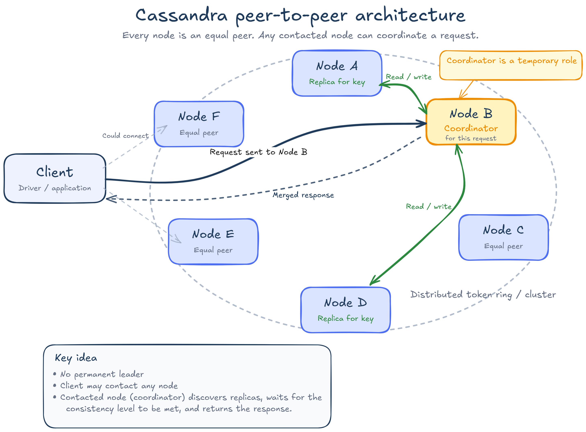
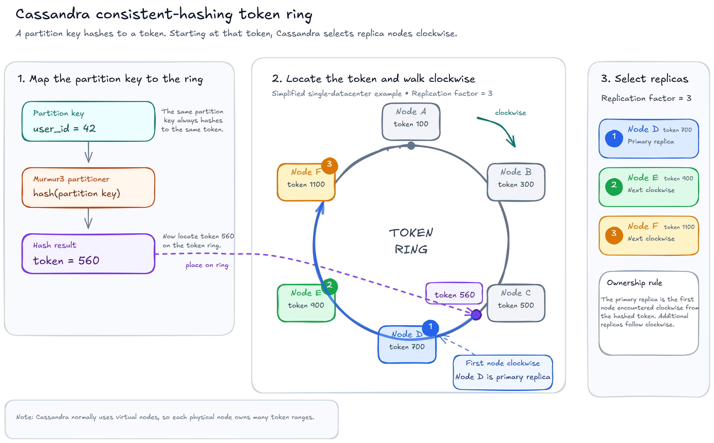
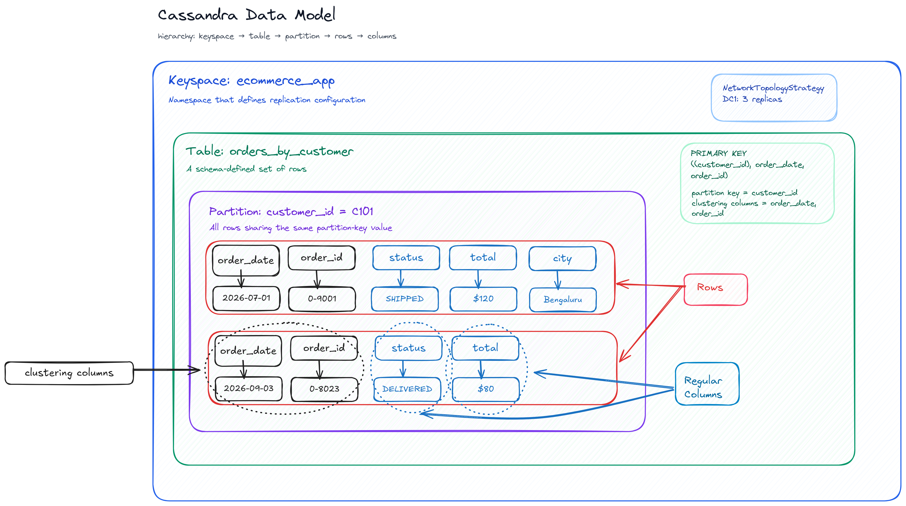

Apache Cassandra is a distributed, wide-column NoSQL database designed for workloads that need:

- High write throughput.
- Horizontal scaling across many nodes.
- Tunable consistency to behave as either CP or AP type of system (CAP theorem)
- Predictable queries over very large datasets.

Cassandra is not a general replacement for PostgreSQL. It performs best when the query patterns are known beforehand and the tables are designed specifically for those queries.


## 1. Why Cassandra Exists

A relational database usually starts with one primary server and scales reads using replicas. As traffic and data grow, the primary can become the write bottleneck. Sharding the relational database is possible, but the application or a separate routing layer must often handle shard ownership, rebalancing and cross-shard limitations.

Cassandra starts with a distributed model:

- Data is partitioned across nodes.
- Every partition is replicated.
- Any node can receive a client request.
- Nodes have equal roles; there is no permanent primary node for normal reads and writes.
- Capacity is increased by adding nodes and redistributing token ranges.

This architecture trades away some relational features like joins, foreign keys, flexible transactions and arbitrary queries, in exchange for scalability & high write throughput.


---

# Cassandra Mental Model

## 5. Peer-to-Peer Architecture

Cassandra uses distributed, masterless peer-to-peer architecture. Every node is identical, eliminating single points of failure. Data is distributed across a virtual ring of nodes using a hashing algorithm, and is replicated for high availability and fault toleranc. Any node can receive a request and act as its coordinator.

<!-- IMAGE PLACEHOLDER
Title: Cassandra peer-to-peer architecture
What to use: A ring or cluster diagram showing equal peer nodes, a client connecting to any node, and one node acting as the coordinator for a request.
Preferred source: Apache Cassandra documentation, "Cassandra Basics".
Search terms: Apache Cassandra Cassandra Basics coordinator node peer-to-peer diagram
Purpose: Establish that Cassandra has no permanent leader and any node can coordinate a request.
Alt text: Client sends a request to one Cassandra node, which coordinates reads or writes with replica nodes.
Editorial note: Verify the image licence before publishing. Prefer an official Apache Cassandra image.
-->


For a request:

1. The client sends the request to a Cassandra node.
2. That node becomes the coordinator for this request.
3. The coordinator determines which nodes own replicas of the partition.
4. It sends requests to the appropriate replicas.
5. It waits for enough responses to satisfy the requested consistency level.
6. It returns success, data, a timeout or an unavailable error to the client.

The coordinator does not have to own the partition. Token-aware clients reduce unnecessary network hops by routing requests to a replica whenever possible.

## 6. Consistent Hashing and Tokens

Cassandra hashes a partition key into a token. The token identifies the position of the partition in Cassandra's token space.




Modern Cassandra clusters normally use virtual nodes, so each physical node owns many smaller token ranges rather than one large continuous range. This makes data distribution and topology changes easier to balance.

<!-- IMAGE PLACEHOLDER
Title: Consistent-hashing token ring
What to use: A token-ring diagram showing a partition key being hashed to a token and the token mapping to multiple replicas.
Preferred source: Apache Cassandra documentation, "Dynamo" architecture page, or the official Apache Cassandra transient-replication article.
Search terms: site:cassandra.apache.org Cassandra replica selection consistent hash ring
Purpose: Explain how a partition key maps to token ownership and replicas.
Alt text: Hashing a partition key places it on the Cassandra token ring and selects replica nodes clockwise around the ring.
-->

## 7. Gossip and Failure Detection

Nodes exchange cluster-state information through gossip. This helps nodes learn about:

- Other nodes in the cluster.
- Node status.
- Topology.
- Schema state.
- Token ownership.

Failure detection uses local observations to determine whether another node is likely unavailable. Gossip is not the data-replication mechanism; it distributes cluster metadata and node-state information.

---

# Data Storage Model

## 8. Keyspace, Table, Partition and Row

A Cassandra data model contains:

- **Keyspace:** A namespace that defines replication configuration. It can be thought of as an equivalent to database in postgres.
- **Table:** A set of rows described by a schema. 
- **Partition:** Rows sharing the same partition-key value.
- **Row:** A unique primary-key combination inside a partition.
- **Column:** A named value in a row.

CQL(Cassandra Query Language) looks similar to SQL, but the storage and query model is different. A CQL table should be understood as a materialized access pattern, not as a normalized relational entity.


## Primary Key & Partition Key

A Cassandra primary key contains:

1. A **partition key**.
2. Zero or more **clustering columns**.

::LEFT::
Example:
```sql
CREATE TABLE events_by_user (
    user_id uuid,
    event_date date,
    country text,
    city text,
    created_at timestamp,
    event_id uuid,
    event_type text,
    PRIMARY KEY (
        (user_id, event_date),
        country, 
        city,
        created_at,
        event_id)
) WITH CLUSTERING ORDER BY ( 
        country ASC, 
        city ASC, 
        created_at DESC, 
        event_id ASC);
```
::END-LEFT::
::RIGHT::
Interpretation:

```text
Partition key       = (user_id, event_date)
Clustering columns  = country, city, created_at, event_id
Regular columns     = event_type
```
::END-RIGHT::

The partition key decides where the data is stored. The clustering columns determine uniqueness and sort order inside the partition. Non-clustering columns are optional when inserting.

Cassandra first sorts by `country`. Rows with the same country are then sorted by `city`, followed by `created_at` and finally `event_id`. This ordering makes equality and range queries on clustering columns efficient.


---

# Supported Query Patterns

Cassandra is designed to answer queries that match the table’s primary-key structure. The partition key tells Cassandra which partition and nodes contain the data. The clustering columns tell Cassandra how rows are ordered inside that partition and which range of rows to read. 

Because of this, Cassandra works best when queries follow below rules. When a query does not follow these, Cassandra usually rejects it instead of silently scanning the entire table. ALLOW FILTERING can force Cassandra to scan and filter extra data, but this may lead to unpredictable latency and should generally be avoided.

The table schema in Cassandra is therefore designed around the queries the application needs to support (more about this in next section).


Consider above table as example:
```text
Partition key       = (user_id, event_date)
Clustering columns  = country, city, created_at, event_id
Regular columns     = event_type
```

::LEFT::

### Partition Key Rules

#### 1. Provide the complete partition key

For an efficient single-partition query, provide all columns of the partition key.

```sql
WHERE user_id = ?
  AND event_date = ?
```

The following provides only part of the composite partition key:

```sql
WHERE user_id = ?
```


---

#### 2. Use equality on partition-key columns

Partition-key columns are normally queried using equality.

```sql
WHERE user_id = ?
  AND event_date = ?
```

Range conditions are not normally supported directly on partition-key columns.

```sql
WHERE user_id = ?
  AND event_date >= ?
```


---

#### 3. `IN` is allowed, but causes partition fan-out

```sql
WHERE user_id = ?
  AND event_date IN (?, ?, ?)
```

This query reads multiple partitions.

**Impact:** Cassandra sends requests to every selected partition. A small `IN` list may be acceptable, but a large list increases coordinator work, network traffic and latency.
::END-LEFT::
::RIGHT::

### Clustering Column Rules

#### 1. Query clustering columns within a partition


First provide the complete partition key & then restrict clustering columns:

```sql
WHERE user_id = ?
  AND event_date = ?
  AND country = ?
```

Querying a clustering column without its partition key is not normally supported:

```sql
WHERE country = ?
```


---

#### 2. Follow clustering-column order

Clustering columns must normally be queried from left to right in the order defined in the primary key.

```text
country → city → created_at → event_id
```

Valid:

```sql
WHERE user_id = ?
  AND event_date = ?
  AND country = ?
  AND city = ?
```

Invalid:

```sql
WHERE user_id = ?
  AND event_date = ?
  AND city = ?
```

Here, `country` is skipped.


---

#### 3. Use equality before a range condition

Once a range condition is used, later clustering columns cannot normally be restricted.

Valid:

```sql
WHERE user_id = ?
  AND event_date = ?
  AND country = ?
  AND city = ?
  AND created_at >= ?
```

Valid:

```sql
WHERE user_id = ?
  AND event_date = ?
  AND country = ?
  AND city = ?
  AND created_at >= ?
  AND created_at < ?
```

Invalid:

```sql
WHERE user_id = ?
  AND event_date = ?
  AND country = ?
  AND city > ?
  AND created_at = ?
```

The range is applied to `city`, so `created_at` cannot normally be restricted afterward.


---

#### 4. `ORDER BY` must follow clustering order

Valid:

```sql
SELECT *
FROM events
WHERE user_id = ?
  AND event_date = ?
  AND country = ?
  AND city = ?
ORDER BY created_at DESC;
```

Invalid:

```sql
ORDER BY event_type;
```

`event_type` is a regular column, not a clustering column.

Invalid:
```sql
SELECT *
FROM events
WHERE user_id = ?
    AND event_date = ?
    AND country = ?
    AND city = ?
ORDER BY event_id DESC;
```
event_id cannot be used for ordering here because created_at, which appears before it in the clustering order, is not restricted by equality.

::END-RIGHT::

---
# Query-First Data Modelling

## Model Tables Around Queries

Relational modelling commonly starts with entities and normalization:

```text
User
Conversation
Message
```

Cassandra modelling starts with application queries:

```text
Get messages for conversation X on date D, newest first.
Get all conversations for user U ordered by last activity.
Get a message by message ID.
```

These may require three separate tables:

```text
messages_by_conversation_day
conversations_by_user
message_by_id
```

The same logical message may be stored in multiple tables. This is intentional denormalization.

> **Core Cassandra principle:** One query pattern, one table.

This does not mean every minor variation needs a table. Similar queries that share the same partition and clustering order can often use one table.

## 15. Data Duplication Is Normal

Suppose a messaging system supports:

1. Fetch a message by ID.
2. Fetch recent messages for a conversation.
3. Fetch conversations for a user.

Possible tables:

```sql
CREATE TABLE message_by_id (
    message_id uuid PRIMARY KEY,
    conversation_id uuid,
    sender_id uuid,
    message_time timestamp,
    body text
);
```

```sql
CREATE TABLE messages_by_conversation_day (
    conversation_id uuid,
    bucket_date date,
    message_time timestamp,
    message_id timeuuid,
    sender_id uuid,
    body text,
    PRIMARY KEY (
        (conversation_id, bucket_date),
        message_time,
        message_id
    )
) WITH CLUSTERING ORDER BY (
    message_time DESC,
    message_id DESC
);
```

```sql
CREATE TABLE conversations_by_user (
    user_id uuid,
    last_activity_time timestamp,
    conversation_id uuid,
    title text,
    PRIMARY KEY (
        (user_id),
        last_activity_time,
        conversation_id
    )
) WITH CLUSTERING ORDER BY (
    last_activity_time DESC
);
```

The application or an event-processing pipeline writes the required projections.

## 16. Write Consistency Across Denormalized Tables

Writes to separate Cassandra tables are not automatically one cross-table transaction in the relational sense.

Common approaches:

### Synchronous dual write

The API writes all query tables before returning.

Advantages:

- Simple.
- Data becomes visible quickly.

Disadvantages:

- Higher latency.
- Partial failures must be handled.
- Retry logic must be idempotent.

### Event-driven projection

The source write emits an event to Kafka. Consumers update query-specific tables.

Advantages:

- Decouples the write path.
- Scales projection workers independently.
- Replays can rebuild projections.

Disadvantages:

- Read tables are eventually consistent.
- Consumers need idempotency.
- Operational complexity increases.

### Logged batch

A logged batch can provide atomic application of a small related set of mutations, but it should not be used as a generic bulk-ingestion optimization. Cross-partition batches add coordinator and batch-log overhead.


---

# Partition Design

[//]: # ()
[//]: # (## 18. Why Partition Design Matters)

[//]: # ()
[//]: # (The partition is Cassandra's unit of placement and a major unit of access.)

[//]: # ()
[//]: # (A poor partition key can cause:)

[//]: # ()
[//]: # (- One node receiving disproportionate traffic.)

[//]: # (- Very large partitions.)

[//]: # (- Long garbage-collection pauses.)

[//]: # (- Expensive compactions.)

[//]: # (- Slow reads.)

[//]: # (- Large repairs and streaming operations.)

[//]: # (- Timeouts affecting an entire cluster.)

[//]: # ()
[//]: # (The partition key must solve two different problems:)

[//]: # ()
[//]: # (```text)

[//]: # (1. Route the query efficiently.)

[//]: # (2. Distribute load evenly.)

[//]: # (```)

[//]: # ()
[//]: # (## 19. Hot Partitions)

[//]: # ()
[//]: # (A hot partition receives much more traffic than other partitions.)

[//]: # ()
[//]: # (Example:)

[//]: # ()
[//]: # (```sql)

[//]: # (PRIMARY KEY &#40;&#40;celebrity_id&#41;, follower_id&#41;)

[//]: # (```)

[//]: # ()
[//]: # (If one celebrity has hundreds of millions of followers and intense read/write traffic, the partition and its replicas become hotspots.)

[//]: # ()
[//]: # (Possible mitigation:)

[//]: # ()
[//]: # (```sql)

[//]: # (PRIMARY KEY &#40;&#40;celebrity_id, shard_id&#41;, follower_id&#41;)

[//]: # (```)

[//]: # ()
[//]: # (Where:)

[//]: # ()
[//]: # (```text)

[//]: # (shard_id = hash&#40;follower_id&#41; % N)

[//]: # (```)

[//]: # ()
[//]: # (A read must query all `N` shards and merge the results, so choose the smallest shard count that removes the hotspot.)

[//]: # ()
[//]: # (## 20. Unbounded Partitions)

[//]: # ()
[//]: # (Bad design:)

[//]: # ()
[//]: # (```sql)

[//]: # (PRIMARY KEY &#40;&#40;device_id&#41;, event_time&#41;)

[//]: # (```)

[//]: # ()
[//]: # (A device that emits events forever creates a partition that grows forever.)

[//]: # ()
[//]: # (Bucketed design:)

[//]: # ()
[//]: # (```sql)

[//]: # (PRIMARY KEY &#40;&#40;device_id, event_date&#41;, event_time, event_id&#41;)

[//]: # (```)

[//]: # ()
[//]: # (Now each device-day is a separate partition.)

[//]: # ()
[//]: # (The application queries multiple date buckets when the requested range spans multiple days.)

[//]: # ()
[//]: # (## 21. Selecting a Time Bucket)

[//]: # ()
[//]: # (A bucket must balance:)

[//]: # ()
[//]: # (- Partition size.)

[//]: # (- Number of partitions per query.)

[//]: # (- Traffic per partition.)

[//]: # (- Retention period.)

[//]: # (- Read-range size.)

[//]: # ()
[//]: # (Example input:)

[//]: # ()
[//]: # (```text)

[//]: # (Events per device per second = 100)

[//]: # (Average row size              = 200 bytes)

[//]: # (```)

[//]: # ()
[//]: # (Estimated daily data:)

[//]: # ()
[//]: # (```text)

[//]: # (100 × 86,400 × 200)

[//]: # (= 1,728,000,000 bytes)

[//]: # (≈ 1.7 GB per device per day)

[//]: # (```)

[//]: # ()
[//]: # (A daily bucket is too large for a comfortable operational target.)

[//]: # ()
[//]: # (Hourly bucket:)

[//]: # ()
[//]: # (```text)

[//]: # (100 × 3,600 × 200)

[//]: # (= 72,000,000 bytes)

[//]: # (≈ 72 MB per device per hour)

[//]: # (```)

[//]: # ()
[//]: # (An hourly bucket is more reasonable.)

[//]: # ()
[//]: # (Possible schema:)

[//]: # ()
[//]: # (```sql)

[//]: # (PRIMARY KEY &#40;&#40;device_id, event_hour&#41;, event_time, event_id&#41;)

[//]: # (```)

[//]: # ()
[//]: # (## 22. Practical Partition-Size Guidance)

[//]: # ()
[//]: # (Cassandra does not provide one universal safe partition size. Workload, row width, hardware and access pattern matter.)

[//]: # ()
[//]: # (For interview estimations:)

[//]: # ()
[//]: # (- Treat approximately `100 MB` as a conservative partition-size target.)

[//]: # (- Consider `100–500 MB` a warning range that needs workload testing.)

[//]: # (- Avoid designing multi-gigabyte partitions.)

[//]: # (- Size by bytes and cells, not only by row count.)

[//]: # (- Keep the number of partitions touched by one online request small and bounded.)

[//]: # ()
[//]: # (These are planning heuristics, not protocol limits.)

[//]: # ()
[//]: # (Approximate partition size:)

[//]: # ()
[//]: # (```text)

[//]: # (partition size)

[//]: # (≈ rows per partition)

[//]: # (× average bytes per row)

[//]: # (× storage overhead)

[//]: # (```)

[//]: # ()
[//]: # (Example:)

[//]: # ()
[//]: # (```text)

[//]: # (50,000 rows)

[//]: # (× 1 KB per row)

[//]: # (≈ 50 MB before overhead)

[//]: # (```)

[//]: # ()
[//]: # (## 23. Large Value and Blob Guidance)

[//]: # ()
[//]: # (Cassandra can store blobs, but it is usually a poor choice for large media objects.)

[//]: # ()
[//]: # (Store:)

[//]: # ()
[//]: # (- Object metadata in Cassandra.)

[//]: # (- Large files in object storage such as S3 or GCS.)

[//]: # (- The object URL or object key in Cassandra.)

[//]: # ()
[//]: # (Large values increase:)

[//]: # ()
[//]: # (- Network payload.)

[//]: # (- Heap and buffer pressure.)

[//]: # (- Compaction I/O.)

[//]: # (- Repair and streaming costs.)

[//]: # (- Tail latency.)

[//]: # ()
[//]: # (---) - commented

# Write Path

## 27. End-to-End Write Flow

For each replica receiving a write:

1. The mutation is appended to the commit log.
2. The mutation is applied to an in-memory memtable.
3. The replica acknowledges the coordinator according to its durability configuration.
4. When the memtable reaches a threshold, it is flushed to disk as a new immutable SSTable.
5. Background compaction later merges SSTables.


The coordinator returns success after enough replicas acknowledge the write for the selected consistency level. It does not need to wait for the memtable to flush to an SSTable.

## 28. Why Writes Are Fast

The storage engine is based on a log-structured merge design.

Writes avoid random in-place updates:

- Commit-log writes are sequential.
- Memtable writes occur in memory.
- SSTables are immutable.
- Multiple updates are merged later during compaction.

This moves work away from the foreground write path, but creates background compaction I/O and possible read amplification.

## 29. Upserts and Timestamps

Cassandra writes are upserts. Writing the same primary key can insert a new row or update existing columns.

Each mutation carries a timestamp. Concurrent values are reconciled using last-write-wins semantics at the cell level.

Consequences:

- Clock synchronization matters.
- An incorrectly future-dated write can overshadow later correct writes.
- Retrying a normal deterministic upsert is usually safe.
- Application-supplied timestamps should be used only when necessary and carefully controlled.

<!-- IMAGE PLACEHOLDER
Title: Cassandra write path
What to use: A diagram showing coordinator to replicas, then commit log and memtable, followed by memtable flush to immutable SSTables and background compaction.
Preferred source: Apache Cassandra documentation, "Storage Engine", or the official Apache Cassandra article "Learn How CommitLog Works".
Search terms: site:cassandra.apache.org Cassandra commit log memtable SSTable write path
Purpose: Explain why foreground writes are sequential and fast.
Alt text: Cassandra writes append to the commit log, update the memtable, flush to SSTables and later compact SSTables.
-->

---

# Read Path

## 30. End-to-End Read Flow

For a partition read:

1. The driver sends the query to a coordinator.
2. The coordinator identifies replicas.
3. It contacts enough replicas to satisfy the consistency level.
4. Each replica checks its memtable and relevant SSTables.
5. The replica merges matching versions and tombstones.
6. The coordinator reconciles replica responses.
7. The newest valid value is returned.
8. Inconsistencies found by the read may trigger read repair.

## 31. Reading from Memtables and SSTables

A partition may have versions spread across:

- The active memtable.
- Flushing memtables.
- Multiple immutable SSTables.

The replica must merge these sources by primary key and timestamp.

This is why a write-optimized LSM database can have a more expensive read path than an in-place B-tree database.

## 32. Bloom Filters

A Bloom filter helps Cassandra answer:

```text
This SSTable definitely does not contain the partition.
```

or:

```text
This SSTable may contain the partition.
```

A Bloom filter can produce false positives but not false negatives. It reduces unnecessary SSTable reads, but it does not remove the need for indexes, partition summaries and disk access when the filter says the partition may exist.

## 33. Read Amplification

Read amplification occurs when a read must inspect many SSTables.

It increases when:

- Compaction falls behind.
- A partition has many overwritten values.
- Tombstones are spread across many SSTables.
- The selected compaction strategy does not match the workload.
- Disk or compaction capacity is insufficient.

Compaction reduces read amplification by merging SSTables, but consumes CPU, disk bandwidth and temporary storage.

## 34. Read Repair

When replicas contacted by a read disagree, Cassandra can reconcile their versions and repair the participating replicas.

Read repair is useful but is not a replacement for regular anti-entropy repair:

- It only repairs data that is read.
- It only involves replicas contacted by the read.
- Cold data may remain inconsistent indefinitely without scheduled repair.

<!-- IMAGE PLACEHOLDER
Title: Cassandra read path
What to use: A diagram showing the coordinator contacting replicas, each replica checking memtable and multiple SSTables through Bloom filters, then returning data for reconciliation.
Preferred source: Apache Cassandra documentation, "Storage Engine", "Bloom Filters" and "Read repair". If no clear official diagram is available, create an original diagram based on these pages instead of copying an outdated third-party diagram.
Search terms: Apache Cassandra read path memtable SSTable Bloom filter coordinator replicas
Purpose: Contrast the read path with the simpler write path.
Alt text: Cassandra replicas merge data from memtables and SSTables, and the coordinator reconciles replica responses.
-->

---

# Replication

## 35. Replication Factor

The replication factor is the number of replicas maintained for each partition in a datacenter.

Common interview assumption:

```text
Replication factor = 3
```

With `RF = 3`, Cassandra stores three copies of each partition in that datacenter.

Replication improves:

- Fault tolerance.
- Read availability.
- Durability.
- Ability to survive a node or availability-zone failure.

It also multiplies storage and write work.

Approximate replicated storage:

```text
replicated logical storage
= raw logical data × replication factor
```

Compaction, snapshots and free-space requirements add further physical storage overhead.

## 36. Replication Strategies

### `NetworkTopologyStrategy`

Use for production clusters.

It supports:

- Per-datacenter replication factors.
- Rack-aware replica placement.
- Multi-region deployments.

Example:

```sql
CREATE KEYSPACE messaging
WITH replication = {
    'class': 'NetworkTopologyStrategy',
    'us_east': 3,
    'eu_west': 3
};
```

### `SimpleStrategy`

Suitable only for simple development or single-datacenter experiments. It is not the normal production choice because it is not topology-aware.

---

# Tunable Consistency

## 37. Consistency Level

A consistency level defines how many replicas must respond before an operation succeeds.

Consistency is selected per operation, so two requests against the same table can choose different trade-offs.

With replication factor `N`:

```text
W = replicas required for write success
R = replicas required for read success
```

When:

```text
R + W > N
```

the read and write replica sets overlap. This can provide strong single-partition visibility under the expected replica topology, although timestamp ordering and clock correctness still matter.

## 38. Common Write Consistency Levels

| Consistency level | Requirement | Main use |
|---|---|---|
| `ANY` | A replica or a stored hint acknowledges | Maximum write availability; rarely used in application design |
| `ONE` | One replica acknowledges | Low latency and high availability |
| `TWO` | Two replicas acknowledge | Fixed replica count |
| `THREE` | Three replicas acknowledge | Fixed replica count |
| `QUORUM` | Majority across all configured replicas | Stronger consistency in a single datacenter |
| `LOCAL_QUORUM` | Majority in the local datacenter | Common multi-datacenter choice |
| `EACH_QUORUM` | Quorum in every datacenter | Strong cross-datacenter write acknowledgement with high latency |
| `ALL` | Every replica acknowledges | Lowest availability |

## 39. Common Read Consistency Levels

| Consistency level | Requirement | Main use |
|---|---|---|
| `ONE` | One replica responds | Lowest latency; stale reads are possible |
| `TWO` | Two replicas respond | Fixed replica count |
| `THREE` | Three replicas respond | Fixed replica count |
| `QUORUM` | Majority across all replicas | Single-datacenter strong-read pattern |
| `LOCAL_QUORUM` | Majority in local datacenter | Common multi-datacenter read choice |
| `ALL` | Every replica responds | Highest replica agreement, lowest availability |
| `SERIAL` | Serial/Paxos phase | Lightweight transactions |
| `LOCAL_SERIAL` | Local serial/Paxos phase | Local-datacenter lightweight transactions |

## 40. Common Configurations

### High availability

```text
RF = 3
Write = ONE
Read = ONE
```

Advantages:

- Low latency.
- Can tolerate multiple replica problems for many operations.

Trade-off:

- A read can return stale data.

### Balanced single-datacenter consistency

```text
RF = 3
Write = QUORUM
Read = QUORUM
```

Because:

```text
2 + 2 > 3
```

read and write quorums overlap.

### Multi-datacenter local consistency

```text
RF per datacenter = 3
Write = LOCAL_QUORUM
Read = LOCAL_QUORUM
```

Advantages:

- The request does not wait for remote-region round trips.
- The local datacenter can provide quorum-based consistency.
- Remote replicas still receive replication traffic.

Trade-off:

- Concurrent writes in different regions can conflict and are reconciled by timestamps.
- A region may not immediately observe a write accepted in another region.

## 41. CAP-Theorem Interpretation

Cassandra is often described as AP-oriented, but saying "Cassandra is always AP" is incomplete.

During a network partition:

- Low consistency levels can allow operations to succeed with fewer replicas, prioritizing availability.
- Quorum or `ALL` can reject an operation when enough replicas are unreachable, prioritizing consistency over availability for that request.
- The database architecture supports eventual convergence, but the selected consistency level determines the request-level behavior.

A better interview answer is:

> Cassandra is an availability-oriented, partition-tolerant database with tunable per-operation consistency. During a partition, the selected consistency level determines whether a request remains available or fails to preserve replica agreement.

<!-- IMAGE PLACEHOLDER
Title: RF=3 and QUORUM consistency
What to use: The official Cassandra Basics diagram where a coordinator contacts three replicas and succeeds after two acknowledgements.
Preferred source: Apache Cassandra documentation, "Cassandra Basics".
Search terms: Apache Cassandra Basics consistency level quorum RF 3 diagram
Purpose: Visually explain why quorum is two replicas when RF is three.
Alt text: A coordinator receives acknowledgements from two of three replicas to satisfy quorum.
-->

---

# Replica Convergence and Repair

## 42. Hinted Handoff

Suppose a replica is temporarily down during a write.

The coordinator can store a hint containing the missed mutation. When the unavailable node returns, Cassandra replays the hint to it.

Hints:

- Improve recovery from short outages.
- Are stored temporarily.
- Are not a replacement for repair.
- Do not guarantee recovery from every long outage.

## 43. Anti-Entropy Repair

Repair compares replicas and streams missing or divergent data.

Conceptually:

1. Replicas build hash trees over token ranges.
2. Hashes are compared.
3. Mismatching ranges are identified.
4. Only required data is streamed.

Repair is essential because hinted handoff and read repair are best-effort mechanisms.

Operationally, repair must run often enough that deleted data cannot reappear after tombstones are garbage-collected.

## 44. Last-Write-Wins Conflict Resolution

Cassandra reconciles conflicting cell values using mutation timestamps.

Example:

```text
Replica A: status = "PROCESSING", timestamp 100
Replica B: status = "COMPLETED",  timestamp 110
```

The value with timestamp `110` wins.

Problems caused by bad clocks:

```text
Replica A receives timestamp 10,000 by mistake.
Correct writes at timestamp 500 appear older and lose.
```

Use reliable time synchronization and avoid arbitrary client-generated timestamps.

## 45. Coordinator Failure

A coordinator is not a permanent leader.

If it fails:

- The current request may time out or return an error.
- A retry can be sent to another node.
- Replica data remains on replica nodes.
- The cluster does not need a leader election for ordinary operations.

Retries must respect idempotency because the original request may have partially succeeded before the client observed the failure.

---

## 2. When to Use Cassandra

Cassandra is a good fit when most of the following are true:

- The system performs a very large number of writes.
- Data volume is expected to grow beyond a single machine.
- The application needs to remain available during node or availability-zone failures.
- Queries are known in advance.
- Each query can target one partition or a small, known set of partitions.
- Denormalization and duplicate storage are acceptable.
- Eventual consistency is acceptable for at least some operations.
- Multi-region active-active writes are required.
- Data naturally belongs to an owner and a bounded bucket, such as `(userId, month)` or `(deviceId, day)`.

Typical use cases include:

- Message history.
- Notification inboxes.
- IoT telemetry.
- Clickstream and event ingestion.
- User activity history.
- Time-series data.
- Large metadata stores.
- Feed or timeline storage.
- Expiring data with a known retention period.

## 3. When Not to Use Cassandra

Avoid Cassandra as the primary database when the system mainly requires:

- Complex joins.
- Foreign-key constraints.
- Flexible ad-hoc queries.
- ACID transactions.
- Strictly correct global counters.
- Frequent full-table scans.
- OLAP-style group-bys over arbitrary dimensions.
- Small datasets and moderate traffic that PostgreSQL can handle comfortably.
- Query patterns that change frequently.
- Exact financial balances or ledgers that depend on serializable transactions.

Examples:

| Requirement | Better starting choice |
|---|---|
| Orders with transactional inventory updates | PostgreSQL or another transactional database |
| Ad-hoc analytics across billions of events | ClickHouse, BigQuery or a data warehouse |
| Sub-millisecond hot counters | Redis |
| Full-text search | Elasticsearch or OpenSearch |
| Small CRUD application | PostgreSQL |
| Durable, high-volume event history queried by known keys | Cassandra |

# Tombstones, TTL and Deletes

## 46. Why Cassandra Uses Tombstones

SSTables are immutable. Cassandra cannot remove a value from every existing SSTable at delete time.

Instead, a delete writes a tombstone:

```text
This value was deleted at timestamp T.
```

Reads use the tombstone to suppress older values.

Later, compaction can permanently remove both the tombstone and the older value after it is safe to do so.

## 47. TTL Expiry

TTL also produces expiration markers.

Example:

```sql
INSERT INTO otp_by_user (
    user_id,
    otp_id,
    otp_hash,
    created_at
)
VALUES (?, ?, ?, ?)
USING TTL 300;
```

After 300 seconds, the value is logically expired. Physical reclamation happens later through compaction.

TTL is useful for:

- Session data.
- OTP records.
- Expiring messages.
- Event-retention windows.
- Temporary deduplication records.

TTL-heavy workloads must still be designed around compaction and tombstone behavior.

## 48. Tombstone Problems

A read may need to scan tombstones before finding live rows.

This can cause:

- High read latency.
- More disk I/O.
- Timeouts.
- Tombstone warnings.
- Heap pressure.

Common causes:

- Queue-like designs that repeatedly delete from the beginning of a partition.
- Frequently overwritten collections.
- Large partitions with many expired rows.
- Queries that scan broad ranges.
- A compaction strategy that does not align with TTL retention.

## 49. Zombie Data

A deleted value can reappear if:

1. One replica misses the deletion.
2. The tombstone is garbage-collected on healthy replicas.
3. The stale replica returns after the tombstone is gone.
4. Repair treats the old value as live data.

Prevent this by:

- Running repair within the required operational window.
- Configuring tombstone grace carefully.
- Avoiding nodes being offline for longer than the repair and grace assumptions.
- Using appropriate repair and replacement procedures.

## 50. Queue Anti-Pattern

Bad pattern:

```text
Append tasks to one partition.
Read the oldest task.
Delete it.
Repeat forever.
```

The beginning of the partition accumulates tombstones, and every read may scan more deleted rows.

Use a proper queue such as Kafka, RabbitMQ or a managed message service.

<!-- IMAGE PLACEHOLDER
Title: Tombstone lifecycle
What to use: A lifecycle diagram showing delete or TTL expiry, tombstone creation, reads suppressing old values, grace period, repair and compaction removal.
Preferred source: Apache Cassandra documentation, "Tombstones". If the page has no reusable diagram, create an original lifecycle diagram from the official description.
Search terms: site:cassandra.apache.org Cassandra tombstones grace period compaction zombie data
Purpose: Explain why a delete is not immediate physical removal.
Alt text: Cassandra writes a tombstone, retains it through a grace period, repairs replicas and removes it during compaction.
-->

---

# Compaction

## 51. Why Compaction Is Required

Memtable flushes create new immutable SSTables. Updates and deletions may be spread across multiple SSTables.

Compaction:

- Reads several SSTables.
- Merges rows by primary key and timestamp.
- Discards shadowed older values.
- Removes eligible tombstones.
- Writes new SSTables.
- Deletes old SSTables after the new files are durable.

Trade-offs:

- **Read amplification:** Number of files checked for a read.
- **Write amplification:** Number of times data is rewritten.
- **Space amplification:** Temporary and persistent extra disk usage.

## 52. Unified Compaction Strategy

For Cassandra 5.0 and later, Unified Compaction Strategy is the general recommendation for new tables and is designed to cover a broad range of workloads.

Use it as the default starting point unless a workload has a clear reason for a specialized strategy.

## 53. Time Window Compaction Strategy

Time Window Compaction Strategy is useful for:

- Time-series data.
- TTL-heavy data.
- Immutable events.
- Data that expires in chronological windows.

It groups SSTables by time window. When every item in an SSTable has expired, the whole SSTable can be removed efficiently.

Example workload:

```text
IoT events retained for 30 days
partitioned by device and hour
written mostly in timestamp order
```

TWCS works poorly when very old and new data are mixed repeatedly into the same SSTables.

## 54. Leveled Compaction Strategy

Leveled Compaction Strategy organizes SSTables into levels and limits overlap at higher levels.

Historically, it was chosen for read-heavy workloads because it reduces the number of SSTables that reads inspect.

Trade-offs:

- Better predictable reads.
- Higher write amplification.
- More compaction I/O.

For new Cassandra 5.0+ tables, evaluate UCS before choosing LCS.

## 55. Size-Tiered Compaction Strategy

Size-Tiered Compaction Strategy groups similarly sized SSTables and merges them.

Characteristics:

- Historically common default behavior.
- Good sequential-write characteristics.
- Can produce higher read and space amplification.
- Large compactions can require substantial free disk space.

For a new Cassandra 5.0+ design, use UCS as the general default rather than selecting STCS automatically.

## 56. Selection Guide

| Workload | Starting point |
|---|---|
| New general-purpose Cassandra 5.0+ table | UCS |
| Time-series data with TTL and ordered writes | TWCS |
| Existing read-heavy design tuned around levels | LCS or migration evaluation to UCS |
| Existing legacy/general table | STCS may exist; evaluate before changing |
| Large immutable event stream | UCS or TWCS depending on expiry pattern |

Do not change compaction strategy casually on a large production table. The change affects future compactions and can create significant I/O.

<!-- IMAGE PLACEHOLDER
Title: Cassandra compaction strategies
What to use: A comparison graphic showing size-tiered groups, leveled SSTables, time windows and unified compaction.
Preferred source: Apache Cassandra documentation, "Compaction" and strategy-specific pages.
Search terms: site:cassandra.apache.org Cassandra UCS STCS LCS TWCS compaction diagram
Purpose: Show that different strategies organize SSTables differently.
Alt text: Comparison of unified, size-tiered, leveled and time-window compaction strategies.
-->

---

# Secondary Access Paths

## 57. Query-Specific Tables

The safest Cassandra access path remains:

```text
Design the primary key around the query.
```

Example requirement:

```text
Get campaigns by advertiser and status.
```

Possible table:

```sql
CREATE TABLE campaigns_by_advertiser_status (
    advertiser_id uuid,
    status text,
    updated_at timestamp,
    campaign_id uuid,
    name text,
    PRIMARY KEY (
        (advertiser_id, status),
        updated_at,
        campaign_id
    )
) WITH CLUSTERING ORDER BY (
    updated_at DESC
);
```

## 58. Storage-Attached Indexes

Storage-Attached Indexes allow indexed filtering on non-primary-key columns and are integrated with Cassandra's memtable and SSTable storage.

They can be useful when:

- The base partitioning remains sensible.
- The query filters on indexed scalar fields.
- Multiple indexed predicates are required.
- The result set is selective and bounded.
- The team has benchmarked the workload.

They do not remove the need for good partition design. An index query that matches a large fraction of the cluster can still be expensive.

Example:

```sql
CREATE INDEX users_age_idx
ON users (age)
USING 'sai';
```

## 59. Legacy Secondary Indexes

Legacy local secondary indexes can be acceptable for narrow cases but often produce distributed fan-out when the partition key is not known.

Avoid treating them like global B-tree indexes in a relational database.

## 60. Materialized Views

Materialized views duplicate base-table data into another primary-key arrangement automatically.

Potential advantages:

- Fewer application-managed writes.
- Another lookup pattern.

Operational concerns:

- Additional write and storage cost.
- View build and repair behavior.
- More complex failure modes.
- Limited flexibility.

For HLD interviews, application-managed query tables are usually easier to reason about unless materialized views are explicitly required and operationally validated.

## 61. Search and Analytics

Use another system when the query requires:

- Tokenized full-text search.
- Fuzzy matching.
- Arbitrary combinations of filters.
- Large aggregations.
- Group-by over many partitions.
- Sorting by arbitrary calculated fields.

Common architecture:

```text
Application write
      |
      v
Kafka / CDC
      |
      +------> Cassandra: online serving by known key
      |
      +------> ClickHouse: analytical queries
      |
      +------> Elasticsearch: search
```

---

# Lightweight Transactions

## 62. Compare-and-Set

Lightweight transactions support conditional mutations.

```sql
INSERT INTO username_claims (
    username,
    user_id
)
VALUES (?, ?)
IF NOT EXISTS;
```

```sql
UPDATE inventory
SET reserved_by = ?
WHERE sku = ?
IF reserved_by = null;
```

Cassandra coordinates a consensus protocol for the conditional operation, which requires more network round trips than a normal write.

## 63. When to Use LWT

Good candidates:

- Claim a unique username.
- Create a resource only if it does not exist.
- Transition a small state machine with compare-and-set.
- Acquire a low-contention logical claim.

Poor candidates:

- Every event write.
- High-contention counters.
- Bulk ingestion.
- Large multi-partition business transactions.
- A workflow that really needs serializable relational transactions.

> **Interview rule:** LWT is a correctness tool, not a default write mode.

## 64. Serial Consistency

Conditional writes use:

- A serial consistency level for the consensus phase.
- A normal consistency level for the final mutation visibility.

`LOCAL_SERIAL` limits the serial phase to the local datacenter. `SERIAL` spans the configured replicas.

---

# Batches

## 65. Logged Batch

A logged batch records the batch in a batch log so that all included mutations can eventually be completed together.

```sql
BEGIN BATCH
    INSERT INTO message_by_id (...) VALUES (...);
    INSERT INTO messages_by_conversation_day (...) VALUES (...);
APPLY BATCH;
```

Use for a small set of related mutations that require atomic application.

## 66. Unlogged Batch

An unlogged batch skips the batch log.

It can reduce protocol overhead for multiple writes that are already efficiently grouped, especially within one partition, but it does not provide the same cross-partition atomicity guarantee.

## 67. Batch Misuse

Do not send thousands of unrelated writes in one batch to make Cassandra "faster."

A large multi-partition batch can:

- Overload the coordinator.
- Create a network bottleneck.
- Increase batch-log work.
- Cause timeouts.
- Produce uneven load.

For bulk ingestion:

- Use asynchronous concurrent writes.
- Use prepared statements.
- Apply backpressure.
- Let token-aware routing distribute requests.

---

# Counters

## 68. Counter Tables

A counter column supports increments and decrements.

```sql
CREATE TABLE video_view_counts (
    video_id uuid PRIMARY KEY,
    views counter
);
```

```sql
UPDATE video_view_counts
SET views = views + 1
WHERE video_id = ?;
```

## 69. Counter Limitations

Counter updates are not naturally idempotent.

If the client times out:

```text
Did the increment fail,
or did it succeed and the response get lost?
```

Retrying may double-count.

Avoid Cassandra counters for:

- Financial balances.
- Inventory quantities.
- Exact billing.
- Rate-limit enforcement requiring strict retry correctness.

Use cases where counters may be acceptable:

- Approximate popularity.
- Operational metrics with reconciliation.
- Counts where occasional correction is possible.

For high-volume counts, a safer design is often:

```text
events -> Kafka -> stream aggregation -> Redis/Cassandra aggregate table
```

---

# Idempotency and Retry Handling

## 70. Why Retries Are Ambiguous

A timeout means the coordinator did not complete the response in time. It does not prove that no replica applied the write.

Therefore:

- A deterministic upsert can usually be retried.
- A counter increment may not be safe to retry.
- An external side effect must use an idempotency key.
- A multi-table projection should track event IDs or versions.

## 71. Event Deduplication Pattern

```sql
CREATE TABLE processed_events_by_consumer_day (
    consumer_name text,
    event_date date,
    event_id uuid,
    processed_at timestamp,
    PRIMARY KEY (
        (consumer_name, event_date),
        event_id
    )
) WITH default_time_to_live = 604800;
```

The consumer records an event ID for a bounded deduplication window.

For strict create-if-absent semantics, LWT may be required, but its throughput cost must be included.

## 72. Versioned Projection Pattern

Store a monotonic source version:

```sql
CREATE TABLE campaign_summary_by_id (
    campaign_id uuid PRIMARY KEY,
    source_version bigint,
    impressions bigint,
    clicks bigint,
    spend decimal,
    updated_at timestamp
);
```

The consumer only applies an event if its source version is newer than the stored projection version. The exact implementation may require conditional updates or an upstream partitioning guarantee.

---

# Multi-Datacenter and Multi-Region Design

## 73. Active-Active Model

Cassandra can place replicas in multiple datacenters and accept writes in more than one datacenter.

Example:

```text
India region: RF 3
Europe region: RF 3
```

Clients normally use local datacenter awareness:

```text
Write: LOCAL_QUORUM
Read:  LOCAL_QUORUM
```

The online request waits for the local quorum, while replication to the remote datacenter occurs without putting the remote round-trip on the critical path.

## 74. Regional Conflict Risk

Suppose two regions concurrently update the same cell:

```text
Region A: status = APPROVED, timestamp 100
Region B: status = REJECTED, timestamp 110
```

Last-write-wins resolves the conflict to `REJECTED`.

This is acceptable only if the business semantics allow it.

Safer patterns:

- Assign each entity a home region for writes.
- Use append-only events rather than overwriting one state cell.
- Use globally unique operation IDs.
- Avoid concurrent multi-region mutation of the same key.
- Use an external workflow or consensus system for globally exclusive decisions.

## 75. Region Failure

With local consistency levels:

- The healthy region can continue serving from its local replicas.
- The failed region's clients must be rerouted.
- The application may see stale remote state until convergence.
- Capacity planning must ensure the surviving region can absorb failover traffic.

<!-- IMAGE PLACEHOLDER
Title: Multi-datacenter Cassandra deployment
What to use: Two datacenters or cloud regions, each with three nodes spread across racks/AZs, with local-quorum reads and writes and cross-region replication.
Preferred source: Official Apache Cassandra or DataStax topology documentation.
Search terms: Cassandra NetworkTopologyStrategy multi datacenter local quorum diagram
Purpose: Explain local quorum and active-active replication.
Alt text: Cassandra replicates each partition across three nodes in each of two regions while clients use local quorum.
-->

---

# Capacity Planning

## 76. Inputs

Estimate:

```text
writes per second
reads per second
peak multiplier
average row size
retention
replication factor
secondary-table duplication
compaction overhead
target disk utilization
measured throughput per node
failure headroom
```

## 77. Storage Formula

```text
raw logical storage
= events per day
× bytes per event
× retention days
```

```text
replicated logical storage
= raw logical storage
× replication factor
```

```text
physical storage target
= replicated logical storage
× denormalization factor
× operational overhead
÷ target disk utilization
```

Operational overhead includes compaction, temporary files, metadata and safety margin.

## 78. Example Storage Calculation

Assume:

```text
Events per day             = 1 billion
Average encoded row size   = 300 bytes
Retention                  = 30 days
Replication factor         = 3
Query-table duplication    = 1.2×
Operational overhead       = 1.5×
Target disk utilization    = 60%
```

Raw data:

```text
1,000,000,000
× 300 bytes
× 30
= 9,000,000,000,000 bytes
≈ 9 TB
```

After replication:

```text
9 TB × 3 = 27 TB
```

After query-table duplication:

```text
27 TB × 1.2 = 32.4 TB
```

After compaction and operational overhead:

```text
32.4 TB × 1.5 = 48.6 TB
```

Provisioned capacity at 60% target utilization:

```text
48.6 TB ÷ 0.60
= 81 TB
```

If each node provides `4 TB` of usable Cassandra data storage:

```text
81 TB ÷ 4 TB
≈ 21 nodes
```

Round up and include failure-domain balance. For example, use `24 nodes` across three availability zones.

## 79. Throughput Formula

Do not use a universal "writes per Cassandra node" number. Benchmark the actual:

- Row size.
- Read/write ratio.
- Consistency level.
- Replication factor.
- Compaction strategy.
- Disk type.
- CPU.
- Network.
- Partition distribution.
- Tail-latency target.

Interview calculation:

```text
nodes for writes
= peak cluster writes per second
÷ measured sustainable writes per node
```

Example benchmark assumption:

```text
Peak logical writes             = 200,000/s
RF                              = 3
Denormalized tables per event   = 2
Physical replica writes         = 200,000 × 3 × 2
                                = 1,200,000/s

Measured safe physical writes
per node                        = 50,000/s
```

```text
1,200,000 ÷ 50,000
= 24 nodes
```

Then add failure and growth headroom.

The `50,000/s` value is an explicit benchmark assumption, not a Cassandra guarantee.

## 80. Latency Targets

For an HLD interview, state targets rather than claiming universal Cassandra latency.

Example:

```text
Within-region point write:
p99 < 10 ms

Within-region single-partition read:
p99 < 20 ms

Cross-region EACH_QUORUM write:
p99 depends on WAN RTT and is not suitable for a low-latency path
```

Then say the targets must be validated through load testing with the production schema and consistency level.

## 81. Disk Headroom

Do not size nodes to 100% disk utilization.

Compaction and streaming need free space. A common planning assumption is to operate around `50–60%` of usable data-disk capacity until production testing supports a different threshold.

Also reserve capacity for:

- One node or one availability zone being unavailable.
- Repair traffic.
- Bootstrap and decommission streaming.
- Traffic growth.
- Compaction backlog.
- Snapshots, if retained locally.

## 82. Node Count Is the Maximum of Constraints

```text
required nodes
= max(
    nodes required for storage,
    nodes required for reads,
    nodes required for writes,
    nodes required for failure tolerance
)
```

A storage-heavy workload may be disk-bound. A small-row workload may be CPU-bound. A repair-heavy cluster may be network-bound.

---

# Failure Scenarios

## 83. One Replica Is Down

Assume:

```text
RF = 3
one replica is down
```

| Consistency level | Expected behavior |
|---|---|
| `ONE` | Read/write can usually succeed using a healthy replica |
| `QUORUM` | Can succeed using the two healthy replicas |
| `ALL` | Fails because all three replicas are required |

The coordinator may store a hint for the failed replica.

## 84. Two Replicas Are Down

Assume:

```text
RF = 3
two replicas are down
```

| Consistency level | Expected behavior |
|---|---|
| `ONE` | Can succeed if the remaining replica is reachable |
| `QUORUM` | Fails because two responses are required |
| `ALL` | Fails |

This demonstrates the consistency-versus-availability trade-off.

## 85. Coordinator Fails Mid-Request

The client may receive a timeout even though some replicas applied the mutation.

The client should:

- Retry idempotent writes.
- Avoid blindly retrying non-idempotent counters.
- Use request IDs for external side effects.
- Apply bounded retries with backoff and jitter.
- Route the retry through the Cassandra driver.

## 86. Entire Availability Zone Fails

If replicas are correctly distributed across three AZs and `RF = 3`:

```text
LOCAL_QUORUM = 2 replicas
```

Loss of one AZ can still leave two replicas and allow local quorum.

This requires:

- Correct rack/AZ topology.
- Balanced replicas.
- Enough surviving compute and disk capacity.
- Application servers able to reroute.

## 87. Network Partition

With `ONE`, both sides may continue accepting operations if each side can reach a replica, creating divergent values.

With `QUORUM`, only a side that can reach a majority for the partition can succeed.

After connectivity returns:

- Hints may replay.
- Reads may repair contacted replicas.
- Scheduled repair guarantees wider convergence.
- Timestamp conflict resolution selects winners.

## 88. Disk Full

A full disk can lead to:

- Failed flushes.
- Failed compactions.
- Node instability.
- Reduced replica availability.

Prevention:

- Disk-utilization alerts.
- Compaction-backlog alerts.
- Capacity headroom.
- Growth forecasts.
- Controlled snapshots.
- Adding capacity before emergency thresholds.

## 89. Repair Has Not Run

Risks:

- Replicas remain inconsistent.
- Old data can survive.
- Tombstone garbage collection can allow zombie resurrection.
- Node replacement and long outages become unsafe.

Repair is a required operational process, not an optional optimization.

---

# Example Schemas

## 90. Messaging History

### Query

```text
Get the latest 50 messages for a conversation on a given day.
```

### Schema

```sql
CREATE TABLE messages_by_conversation_day (
    conversation_id uuid,
    bucket_date date,
    message_time timestamp,
    message_id timeuuid,
    sender_id uuid,
    body text,
    PRIMARY KEY (
        (conversation_id, bucket_date),
        message_time,
        message_id
    )
) WITH CLUSTERING ORDER BY (
    message_time DESC,
    message_id DESC
);
```

### Query

```sql
SELECT *
FROM messages_by_conversation_day
WHERE conversation_id = ?
  AND bucket_date = ?
  AND message_time < ?
LIMIT 50;
```

### Why it works

- The full partition key is provided.
- Messages are already ordered newest first.
- The day bucket bounds partition growth.
- `message_id` breaks timestamp ties.

### Limitation

A query spanning seven days must query up to seven partitions and merge results in the application.

## 91. User Notification Inbox

### Query

```text
Get the newest notifications for one user.
```

```sql
CREATE TABLE notifications_by_user_month (
    user_id uuid,
    bucket_month date,
    created_at timestamp,
    notification_id timeuuid,
    notification_type text,
    payload text,
    is_read boolean,
    PRIMARY KEY (
        (user_id, bucket_month),
        created_at,
        notification_id
    )
) WITH CLUSTERING ORDER BY (
    created_at DESC,
    notification_id DESC
);
```

Do not query unread notifications by filtering `is_read = false` across a huge partition.

Create a separate table if unread lookup is a required access pattern:

```sql
CREATE TABLE unread_notifications_by_user (
    user_id uuid,
    created_at timestamp,
    notification_id timeuuid,
    payload text,
    PRIMARY KEY (
        (user_id),
        created_at,
        notification_id
    )
) WITH CLUSTERING ORDER BY (
    created_at DESC,
    notification_id DESC
);
```

This table needs a deletion when a notification becomes read, so monitor tombstone behavior or use smaller buckets.

## 92. IoT Events

### Query

```text
Get events for a device between two timestamps.
```

```sql
CREATE TABLE events_by_device_hour (
    device_id text,
    event_hour timestamp,
    event_time timestamp,
    event_id timeuuid,
    event_type text,
    payload blob,
    PRIMARY KEY (
        (device_id, event_hour),
        event_time,
        event_id
    )
) WITH CLUSTERING ORDER BY (
    event_time ASC,
    event_id ASC
);
```

Use TTL or table-level default TTL for retention.

For immutable chronological data, evaluate TWCS.

## 93. Ad Click Events

### Query

```text
Get raw clicks for a campaign in one hour.
```

```sql
CREATE TABLE clicks_by_campaign_hour (
    campaign_id uuid,
    event_hour timestamp,
    click_time timestamp,
    click_id timeuuid,
    ad_id uuid,
    user_id text,
    country text,
    device_type text,
    PRIMARY KEY (
        (campaign_id, event_hour),
        click_time,
        click_id
    )
) WITH CLUSTERING ORDER BY (
    click_time ASC,
    click_id ASC
);
```

Cassandra is suitable for durable event serving by campaign and hour.

It is not the ideal database for arbitrary analytics such as:

```text
Group clicks by any combination of country, device, placement and 15-minute window.
```

Send the events to ClickHouse or a warehouse for that query family.

## 94. Rate Limiter

A strict online rate limiter usually needs:

- Atomic increment and expiry.
- Very low latency.
- Correct retry behavior.
- A decision on every request.

Redis is normally better for the hot enforcement path.

Cassandra can be used for:

- Durable rate-limit rule configuration.
- Long-term usage history.
- Asynchronous audit events.
- Rebuilding approximate counters after a cache loss.

Avoid Cassandra counters for strict request admission because counter retries are non-idempotent and the database round trip is heavier than an in-memory Redis operation.

## 95. Feed Storage

### Query

```text
Get the newest feed entries materialized for a user.
```

```sql
CREATE TABLE feed_entries_by_user_day (
    user_id uuid,
    feed_date date,
    rank_time timestamp,
    entry_id timeuuid,
    actor_id uuid,
    post_id uuid,
    entry_type text,
    PRIMARY KEY (
        (user_id, feed_date),
        rank_time,
        entry_id
    )
) WITH CLUSTERING ORDER BY (
    rank_time DESC,
    entry_id DESC
);
```

Large celebrities can make fan-out-on-write expensive. Cassandra solves storage and serving, not the entire feed-generation strategy.

## 96. Idempotency Records

### Query

```text
Check whether a payment API idempotency key was already processed.
```

```sql
CREATE TABLE idempotency_by_merchant (
    merchant_id uuid,
    idempotency_key text,
    request_hash text,
    response_code int,
    response_body text,
    created_at timestamp,
    PRIMARY KEY (
        (merchant_id),
        idempotency_key
    )
);
```

A strict create-only claim may require:

```sql
INSERT ... IF NOT EXISTS
```

For a financial workflow, Cassandra should not automatically be assumed to be the system of record merely because it can store the idempotency record.

---

# Operational Considerations

## 97. Prepared Statements

Use prepared statements for repeated queries.

Benefits:

- Lower parsing overhead.
- Clear parameter binding.
- Driver can learn partition-key metadata.
- Token-aware routing can route requests efficiently.

Do not prepare a new statement for every unique literal query.

## 98. Driver Behaviour

Use an official or well-supported Cassandra driver with:

- Token-aware load balancing.
- Local-datacenter awareness.
- Connection pooling.
- Request timeouts.
- Bounded retries.
- Idempotency metadata.
- Paging.
- Speculative execution only for safe, idempotent operations.

The driver is part of the distributed-system design, not a thin afterthought.

## 99. Backpressure

Cassandra can accept large write volumes, but unlimited client concurrency can overload:

- Coordinator queues.
- Replica mutation stages.
- Commit-log disks.
- Memtable flushes.
- Compaction.
- Network.

Use:

- Bounded in-flight requests.
- Queue-size monitoring.
- Adaptive concurrency.
- Retry budgets.
- Exponential backoff with jitter.
- Load shedding when the cluster is saturated.

## 100. Monitoring

Track at least:

### Latency

- Read p50, p95 and p99.
- Write p50, p95 and p99.
- Timeout and unavailable rates.
- Coordinator versus replica latency.

### Storage engine

- Memtable size and flush rate.
- Pending flushes.
- Compaction pending tasks.
- SSTable count.
- Tombstones scanned.
- Bloom-filter false positives.
- Disk utilization.
- Commit-log usage.

### Cluster health

- Node up/down status.
- Dropped messages.
- Hints pending and delivery rate.
- Repair status.
- Streaming activity.
- Token balance.
- Cross-node latency.
- Garbage-collection pauses.

### Application distribution

- Requests by partition key.
- Top hot partitions.
- Read/write rate by table.
- Result size.
- Partitions touched per request.

## 101. Repair Operations

A production runbook should define:

- Repair frequency.
- Incremental or full-repair strategy.
- Maximum node outage duration.
- Tombstone grace assumptions.
- Repair concurrency and throttling.
- Handling a node that has been down too long.
- Replacement and bootstrap procedures.
- Validation after repair.

## 102. Adding a Node

High-level process:

1. Provision the node in the correct datacenter and rack.
2. Join it to the cluster.
3. Cassandra assigns token ownership.
4. Existing replicas stream ranges to the new node.
5. Monitor streaming and cluster balance.
6. Validate repair and application latency.

Adding capacity consumes network and disk I/O. Do it before the cluster is already critically overloaded.

---

# Cassandra Versus Other Databases

## 103. Comparison Table

| Database | Best at | Main limitation compared with Cassandra |
|---|---|---|
| PostgreSQL | Transactions, joins, constraints and flexible queries | Harder to horizontally scale writes to many nodes |
| Redis | Sub-millisecond cache, counters, locks and rate limiting | Memory cost and weaker fit for large durable history |
| DynamoDB | Managed key-value/wide-column scale | Cloud-provider coupling and service-specific cost model |
| MongoDB | Document-centric application data and flexible document queries | Different scaling and consistency model; high-write time-series serving may favour Cassandra |
| ClickHouse | OLAP scans, aggregations and analytical filtering | Not the normal choice for low-latency per-key transactional serving |
| Elasticsearch | Text search and inverted-index queries | Not the primary durable source for high-volume keyed event history |
| ScyllaDB | Cassandra-compatible high-performance distributed storage | Different implementation, operations and ecosystem choices |
| Cassandra | High-volume writes, known partition queries and multi-region availability | Limited transactions, joins and ad-hoc queries |

## 104. Cassandra Versus PostgreSQL

Choose Cassandra when:

- Horizontal write scaling is central.
- Availability across node/AZ failures is mandatory.
- Queries can be predefined and partitioned.
- Multi-region active-active is required.
- Denormalization is acceptable.

Choose PostgreSQL when:

- Correctness depends on transactions and constraints.
- Joins are common.
- Query patterns evolve.
- Data fits one primary with replicas or manageable sharding.
- Developer simplicity matters more than extreme write scale.

## 105. Cassandra Versus Redis

Choose Redis for:

- Cache.
- Rate limiting.
- Atomic counters.
- Leaderboards.
- Ephemeral sessions.
- Sub-millisecond access.

Choose Cassandra for:

- Durable history.
- Datasets larger than memory.
- Time-bucketed event storage.
- Multi-region replicated serving.
- Long retention.

A common design uses both:

```text
Redis     -> current hot state
Cassandra -> durable history
```

## 106. Cassandra Versus ClickHouse

Cassandra query:

```text
Fetch events for device X on day D between T1 and T2.
```

ClickHouse query:

```text
Group all events by country, device type and 15-minute interval for the last 30 days.
```

Cassandra serves bounded partitions. ClickHouse scans and aggregates columns across large datasets.

## 107. Cassandra Versus DynamoDB

Both support partition-key-oriented design and horizontal scale.

Cassandra provides:

- Self-managed deployment control.
- Multi-cloud or on-premises operation.
- Tunable consistency and topology.
- No per-request managed-service pricing.

DynamoDB provides:

- Managed operations.
- Automatic infrastructure handling.
- Tight integration with AWS.
- Service-defined capacity and pricing models.

The decision is often operational and organizational, not merely technical.

---

# Common Mistakes

## 108. Modelling Entities Instead of Queries

Bad:

```text
Create users, posts and comments tables.
Expect joins later.
```

Better:

```text
List every required query.
Create partitioned tables for those queries.
```

## 109. Low-Cardinality Partition Key

Bad:

```sql
PRIMARY KEY ((country), user_id)
```

A country such as India can create a massive hot partition.

Better:

```sql
PRIMARY KEY ((country, shard_id), user_id)
```

Or choose a query design that starts from a higher-cardinality owner.

## 110. Unbounded Partition

Bad:

```sql
PRIMARY KEY ((user_id), event_time)
```

Better:

```sql
PRIMARY KEY ((user_id, event_month), event_time)
```

## 111. Random Filtering

Bad:

```sql
SELECT *
FROM events
WHERE event_type = 'CLICK'
ALLOW FILTERING;
```

Better:

```text
Create events_by_type_bucket or send data to an analytical store.
```

## 112. Overusing Batches

Bad:

```text
Batch 50,000 unrelated events.
```

Better:

```text
Use concurrent asynchronous token-aware writes with backpressure.
```

## 113. Treating Counter Updates as Idempotent

Bad:

```text
Timeout -> retry increment without knowing whether it succeeded.
```

Better:

```text
Store immutable events and aggregate them, or use an idempotent operation model.
```

## 114. Ignoring Tombstones

Bad:

```text
Use Cassandra as a queue and continuously delete old rows.
```

Better:

```text
Use Kafka for queues and time-bucketed TTL tables for expiring history.
```

## 115. Cross-Region `QUORUM` on the Critical Path

A global quorum can add WAN latency and reduce availability.

For multi-region serving, begin by evaluating:

```text
LOCAL_QUORUM
```

and define how cross-region conflicts are avoided or tolerated.

## 116. Using Cassandra for Ad-Hoc Analytics

Bad:

```text
Store raw ad events and expect arbitrary group-by queries from Cassandra.
```

Better:

```text
Cassandra for known online queries.
ClickHouse or a warehouse for analytics.
```

## 117. No Repair Plan

A Cassandra cluster without a repair plan is incomplete.

The design must include:

- Repair scheduling.
- Outage-duration limits.
- Monitoring.
- Tombstone-grace assumptions.
- Node-replacement procedure.

## 118. Assuming Linear Scale Without Benchmarking

Adding nodes helps only when:

- Partitions are balanced.
- Workload is distributed.
- Clients use token-aware routing.
- Compaction and disks are healthy.
- No external bottleneck dominates.

A single hot key does not become scalable merely because the cluster has more nodes.

---

# Interview Decision Framework

## 119. Choose Cassandra When

```text
[ ] Writes are very high.
[ ] Data exceeds one machine.
[ ] The system needs horizontal scale.
[ ] Query patterns are known.
[ ] Queries can target bounded partitions.
[ ] Denormalization is acceptable.
[ ] Node/AZ failures must not stop the service.
[ ] Eventual consistency is acceptable for some operations.
[ ] Multi-region replication is important.
[ ] The team can operate repair, compaction and capacity planning.
```

## 120. Avoid Cassandra When

```text
[ ] The system needs joins.
[ ] Transactions span many entities.
[ ] Exact global counters are central.
[ ] Query patterns are unknown or ad hoc.
[ ] The dataset is small.
[ ] Full-table aggregations are common.
[ ] Strong consistency is required for nearly every workflow.
[ ] The team does not want to operate a distributed database.
```

## 121. Design Checklist

For a Cassandra table:

```text
[ ] Write down the exact query.
[ ] Identify equality filters.
[ ] Select the partition key.
[ ] Select clustering order.
[ ] Estimate partition size.
[ ] Estimate traffic per partition.
[ ] Add time or hash buckets if required.
[ ] Decide replication factor.
[ ] Decide read and write consistency.
[ ] Define TTL and compaction strategy.
[ ] Define idempotent retry behavior.
[ ] Define repair and monitoring.
[ ] Load-test p99 latency and compaction.
```

---

# Interview Questions and Answers

## 122. Why Are Cassandra Writes Fast?

Cassandra appends the mutation to a sequential commit log and updates an in-memory memtable. It does not perform a random in-place update of an on-disk page. Memtables are later flushed as immutable SSTables, and merging is deferred to background compaction.

The trade-off is that reads and compaction can become more expensive.

## 123. What Is the Difference Between Partition Key and Clustering Key?

The partition key is hashed to determine which nodes store the partition. Clustering columns sort and uniquely identify rows inside that partition.

```sql
PRIMARY KEY ((user_id, month), created_at, event_id)
```

```text
Partition key:    user_id + month
Clustering keys:  created_at + event_id
```

## 124. Why Does Cassandra Duplicate Data?

Cassandra does not perform distributed joins for normal application queries. Data is denormalized into query-specific tables so that each request can target a known partition and return already-ordered data.

## 125. How Do You Prevent Large Partitions?

- Add a time bucket.
- Add a hash shard.
- Estimate rows and bytes per partition.
- Bound retention.
- Monitor large partitions.
- Keep online queries to a small number of buckets.

## 126. What Happens During a Quorum Read?

The coordinator contacts enough replicas to obtain a quorum response, reconciles versions by timestamp and returns the newest valid data. If contacted replicas disagree, read repair may update them.

## 127. What Does `R + W > RF` Mean?

It means the read and write replica sets must overlap.

For:

```text
RF = 3
R = 2
W = 2
```

```text
2 + 2 > 3
```

At least one replica participating in the read must have acknowledged the write.

## 128. Why Is Cassandra Called Eventually Consistent?

Different replicas can temporarily hold different versions because operations may succeed without every replica participating. Hinted handoff, read repair and anti-entropy repair drive replicas toward convergence.

## 129. What Is a Tombstone?

A tombstone is a deletion marker. It suppresses older values until compaction can safely remove both the tombstone and the deleted data.

## 130. Why Can Deletes Hurt Cassandra?

Deleted or expired rows remain as tombstones for a period. Reads may scan these markers, increasing I/O and latency. Large volumes of tombstones can cause timeouts.

## 131. What Is Compaction?

Compaction merges immutable SSTables, reconciles versions, removes shadowed values and deletes eligible tombstones. It reduces read amplification but creates write and space amplification.

## 132. Which Compaction Strategy Should Be Used?

For Cassandra 5.0+, begin with UCS for new general-purpose tables. Use TWCS for time-series or TTL-heavy workloads with time-ordered writes. Existing LCS or STCS tables may remain valid, but changes require workload-specific evaluation.

## 133. What Is Hinted Handoff?

When a replica is temporarily unavailable, a coordinator stores the missed mutation as a hint and replays it when the node returns. It helps short outages but does not replace repair.

## 134. What Is Read Repair?

During a read, if contacted replicas disagree, Cassandra reconciles the values and can update inconsistent replicas.

## 135. Why Is Scheduled Repair Still Required?

Hints expire and read repair only touches read data. Scheduled repair compares replica ranges and synchronizes cold or missed data, providing wider convergence.

## 136. What Happens If a Coordinator Fails?

The request may fail or time out, but no permanent database leader is lost. The client can retry through another node. Because the original request may have partially succeeded, retries must be idempotent.

## 137. Why Is `ALLOW FILTERING` Dangerous?

It can make the amount of scanned data unpredictable. A query that works in development may scan millions of rows in production. The table should normally be redesigned around the access pattern.

## 138. When Should Lightweight Transactions Be Used?

Use them for rare compare-and-set requirements such as claiming a unique username. Avoid using them for every write because consensus adds latency and reduces throughput.

## 139. Are Cassandra Batches a Bulk-Write Optimization?

No. Logged batches mainly provide atomic application for a small related group of mutations. Large unrelated batches overload the coordinator. Bulk ingestion should use asynchronous concurrent writes.

## 140. Why Are Cassandra Counters Difficult?

A timed-out counter increment may have succeeded. Retrying can apply the increment twice. This non-idempotency makes counters unsuitable for exact financial or admission-control logic.

## 141. Cassandra or Redis for Rate Limiting?

Use Redis for the hot rate-limit decision because it supports very low-latency atomic operations and expiry. Use Cassandra for durable configuration, audit history or longer-term usage records.

## 142. Cassandra or ClickHouse for Click Analytics?

Use Cassandra when the query is keyed and bounded:

```text
Get clicks for campaign C during hour H.
```

Use ClickHouse when the query scans and aggregates:

```text
Group all clicks by country and device over 30 days.
```

## 143. How Would You Design Cassandra for Multi-Region?

- Use `NetworkTopologyStrategy`.
- Keep multiple replicas per region.
- Spread replicas across AZs/racks.
- Use datacenter-aware drivers.
- Usually use `LOCAL_QUORUM` for online reads and writes.
- Define conflict semantics.
- Prefer a home region when the same entity cannot safely accept concurrent writes.
- Ensure each region can handle failover traffic.

## 144. What Is the Biggest Cassandra Design Mistake?

Choosing a schema before writing down the queries. Cassandra schema design must begin with the exact read paths, partition boundaries and traffic distribution.

---

# Thirty-Second Summary

```text
Cassandra is a masterless, distributed wide-column database.

It is best for:
- High write throughput.
- Large datasets.
- Known, partition-key-based queries.
- High availability and multi-region replication.

Its core design rules are:
- Model tables around queries.
- Partition data evenly.
- Keep partitions bounded.
- Denormalize instead of joining.
- Choose consistency per operation.
- Plan for compaction, tombstones and repair.

Do not use it by default for:
- Joins.
- Cross-row transactions.
- Ad-hoc analytics.
- Strict global counters.
- Small CRUD applications.
```

<!--
EDITORIAL SOURCES TO VERIFY BEFORE PUBLISHING

Use the current Apache Cassandra documentation as the primary source:

- Overview
- Cassandra Basics
- Dynamo architecture
- Storage Engine
- Developing: Data Modeling
- Logical Data Modeling
- Evaluating and Refining Data Models
- Data Definition / CREATE TABLE
- Guarantees
- Hints
- Read Repair
- Tombstones
- Compaction
- Unified Compaction Strategy
- Time Window Compaction Strategy
- Leveled Compaction Strategy
- Secondary Indexes / Storage-Attached Indexes
- CQL BATCH documentation
- Counter columns
- Cassandra configuration and guardrails

Version note:
- Recheck recommendations when the website is updated.
- UCS and SAI guidance is particularly version-sensitive.
- Capacity and latency numbers in this article are explicit interview assumptions, not product guarantees.
-->
